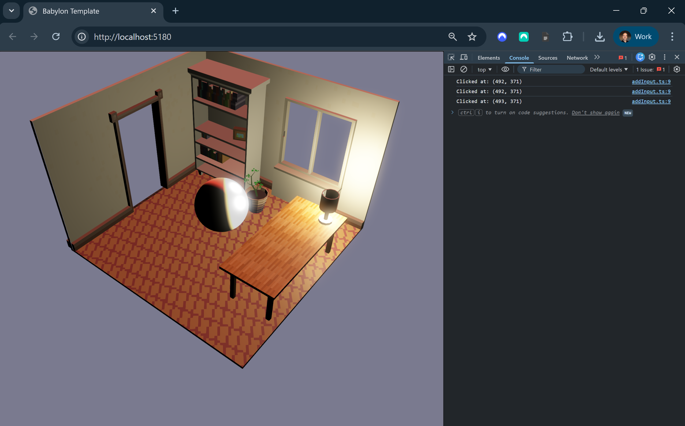

# Babylon.js Project Template

This repo is a starting point for [Babylon.js](https://www.babylonjs.com/) projects using [TypeScript](https://www.typescriptlang.org/), featuring physics, post-processing, and modular structure.

<figure>
    
    <figcaption>Image 1 - Babylon.js Game Engine - Html5 + WebGPU</figcaption>
</figure>

### Table of Contents

1. [Getting Started](#getting-started)
1. [Project Overview](#project-overview)
1. [Project Details](#project-details)
1. [Resources](#resources)
1. [Credits](#credits)

 

# Getting Started

### Play Project

1. Clone or download this repo
2. Open the `Babylon` folder in the command line:
    1. Install dependencies:
        * Run `npm install` to download and install dependencies.
    1. Build the project:
        * Run `npm run build` to build the project.
    1. Run the project:
        * Run `npm run dev` to launch a server at localhost. This serves the development build and hot-reloads on changes within the _**src**_.

### More Commands

You can run these terminal commands during your workflows.

| Command            | Description                                                               | Builds? | Runs?   | Tests?  | Watches?  |
|--------------------|---------------------------------------------------------------------------|---------|--------|--------|----------|
| `npm install`      | Download and install dependencies                                         | ❌      | ❌     | ❌     | ❌       |
| `npm run build`    | Build app                                                                 | ✅      | ❌     | ❌     | ❌       |
| `npm run dev`      | Run app on localhost (Hot Reload) | ❌      | ✅     | ❌     | ✅       |
| `npm run test`     | Run unit tests                                                            | ❌      | ❌     | ✅     | ✅       |
 

# Project Overview

This repo demonstrates best practices for browser-based game development using Babylon.js, TypeScript, and modular architecture. It includes physics integration, post-processing, and input handling.

Use cases include prototypes, educational projects, and browser games.

 

**Documentation**
* `README.md` - The primary documentation for this repo
* `Babylon/README.md` - More info specific to the project

**Configuration**
* `Game Engine` - [Babylon.js](https://www.babylonjs.com/) is a powerful 3D engine for web-based graphics and games

**Structure**
* `Babylon` - Main project folder
* `Babylon/public/assets/glb/` - 3D assets (GLB)
* `Babylon/public/index.html` - Entry HTML page
* `Babylon/src/client/styles/` - CSS styling
* `Babylon/src/client/scripts/` - TypeScript files for client logic
* `Babylon/src/client/scripts/index.ts` - Main TS file for game logic
* `Babylon/src/tests/client/` - Unit tests

**Dependencies**
* `Babylon/package.json` - Lists project dependencies and scripts. When you run `npm install` it installs whatever is here

 

# Project Details

**Editor Tooling**

| Name                                                                                           | Description                                    | Runtime? | Edit Time? |
|------------------------------------------------------------------------------------------------|------------------------------------------------|----------|------------|
| [Visual Studio Code](https://code.visualstudio.com/)                                           | Source code editor                             | ❌       | ✅          |
| [ESLint extension](https://marketplace.visualstudio.com/items?itemName=dbaeumer.vscode-eslint) | VS Code extension for linting JavaScript/TS    | ❌        | ✅          |
| [Error Lens extension](https://marketplace.visualstudio.com/items?itemName=usernamehw.errorlens)| Highlights errors and warnings in VS Code      | ❌        | ✅          |
| [Babylon.js Inspector](https://doc.babylonjs.com/toolsAndResources/inspector)                  | Scene Inspector for Babylon.js                 | ✅        | ❌          |

**Code Packages (Partial List)**

| Name                                                              | Description                                         | Runtime? | Edit Time? |
|-------------------------------------------------------------------|-----------------------------------------------------|----------|--------------|
| [@babylonjs/core](https://www.npmjs.com/package/@babylonjs/core)   | Babylon.js core 3D engine                           | ✅       | ❌           |
| [@babylonjs/loaders](https://www.npmjs.com/package/@babylonjs/loaders)| Babylon.js asset loaders                        | ✅       | ❌           |
| [vite](https://www.npmjs.com/package/vite)                        | Bundles JavaScript files                            | ❌       | ✅           |
| [typescript](https://www.npmjs.com/package/typescript)             | TypeScript compiler                                 | ❌       | ✅           |
| [eslint](https://www.npmjs.com/package/eslint)                    | Linting for TypeScript                              | ❌       | ✅           |
| [vitest](https://www.npmjs.com/package/vitest)                    | Unit testing for TypeScript                         | ❌       | ✅           |

 

# Resources

* [Babylon.js Documentation](https://doc.babylonjs.com/)
* [Babylon.js Playground](https://playground.babylonjs.com/)
* [Babylon.js Inspector](https://doc.babylonjs.com/toolsAndResources/inspector)
* [TypeScript Documentation](https://www.typescriptlang.org/docs/)

 

# Credits

**Created By**

- Samuel Asher Rivello 
- Over 25 years XP with game development (2026)

**Contact**

- Twitter - <a href="https://twitter.com/srivello/">@srivello</a>
- Git - <a href="https://github.com/SamuelAsherRivello/">Github.com/SamuelAsherRivello</a>
- Resume & Portfolio - <a href="http://www.SamuelAsherRivello.com">SamuelAsherRivello.com</a>
- LinkedIn - <a href="https://Linkedin.com/in/SamuelAsherRivello">Linkedin.com/in/SamuelAsherRivello</a> <--- Say Hello! :)

**License**

Provided as-is under MIT License | Copyright © 2026 Rivello Multimedia Consulting, LLC